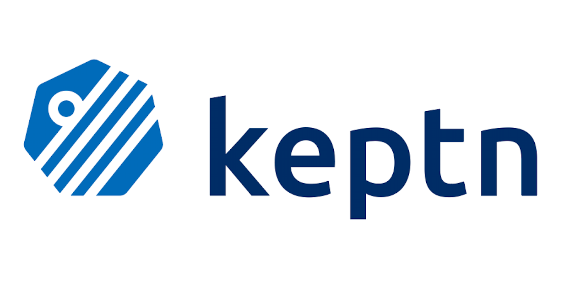

 

 
<h1>Keptn</h1>
<h3>
Timeframe for Metrics
</h3>

# Table of Contents

- [Introduction](#introduction)
- [Project team](#project-team)
- [Contacts](#contacts)
- [Work Summary](#work-summary)
  - [Support for Interval](#support-for-interval)
  - [Support for Aggregation functions](#support-for-aggregation-functions)
- [Future Work to be done](#future-work-to-be-done)
- [Challenges](#challenges)
- [Acknowledgments](#acknowledgments)
- [References](#references)

# Introduction

Currently, the Metrics Controller in the Keptn Lifecycle Toolkit only allows querying a
single value per metric. This project will enable users to define timeframes for metrics
and get standardized aggregated results for the given timeframe. The addition of time
frames for metrics would provide developers with a lot of flexibility when analyzing
their application’s performance as they would be able to easily switch between different
timeframes to get a better understanding of how their application is performing. This can
be achieved by modifying the structure of the Metric CRD by adding certain fields and then
modifying the APIs of our Metric providers to support these newly added fields. The metrics
controller would be able to query metrics over a timeframe and then return raw values from
the providers which can then be passed to the aggregation functions to calculate the desired
aggregated value. These values would be updated in the Metric CRD.

# Project team

- Contributor: Rakshit Gondwal - [GitHub](https://github.com/rakshitgondwal/) | [LinkedIn](https://www.linkedin.com/in/rakshit-gondwal-911223230/) | [Twitter](https://twitter.com/RakshitGondwal)
- Mentors:
  - Florian Bacher - [GitHub](https://github.com/bacherfl/) | [LinkedIn](https://www.linkedin.com/in/florian-bacher-6a58ab79/) | [Twitter](https://twitter.com/bacherfl)
  - Thomas Schuetz - [GitHub](https://github.com/thschue/) | [LinkedIn](https://www.linkedin.com/in/thschue/) | [Twitter](https://twitter.com/ThSchue)

# Contacts

- Slack: `#help`, `#help-contributing` on [Keptn Slack](https://keptn.sh/community/#slack)

# Project Details

The addition of the feature to define the timeframe in metrics would help developers in
many ways such as developers would be able to retrieve aggregated values for a
specific time frame. This would help to analyze the performance of their application or
service more easily. This can help in improving the monitoring capabilities too. By
retrieving aggregated values, developers would be able to save a lot of time while
analyzing the metrics. The addition of time frames for metrics would provide developers
with a lot of flexibility when analyzing their application’s performance. They would be
able to easily switch between different timeframes to get a better understanding of how
their application is performing at different times of the day or week. 

Features this project includes: 
* Define an Interval for which you want your metric to be queried.
* Define a Step which would act as a threshold in the time interval.
* Define an aggregation function which you want to be applied on the data recieved from the SLI provider.
* Define how many values you want that should be stored in the `KeptnMetric`.

# Work Summary

The two major milestones of this project were:
1. Support for Interval
2. Support for Aggregation functions

## Support for Interval

- To query metrics over a timeframe, we introduced a new `range.interval` field in the `KeptnMetric` which is defined as the duration of the time interval for the data query. This field would accept a string value, which has to be a duration such as "1m", "1h" etc.
- To verify if the value inputed by the user is correct or not, we used https://pkg.go.dev/time#ParseDuration to parse the the field's value with the help of a validating webhook.
- This feature required updating the APIs of the SLI providers such as Prometheus, Dynatrace and Datadog.

**PRs for this particular milestone:**
1. feat: add support for timeframe in KeptnMetric [#1471](https://github.com/keptn/lifecycle-toolkit/pull/1471)
2. feat: update Prometheus API to query metrics over a range [#1587](https://github.com/keptn/lifecycle-toolkit/pull/1587)
3. feat: update Datadog API to query metrics for range [#1615](https://github.com/keptn/lifecycle-toolkit/pull/1615)
4. feat: update Dynatrace provider to query metrics over a range [#1658](https://github.com/keptn/lifecycle-toolkit/pull/1658)
5. feat: add interval field for kubectl get KeptnMetric [#1689](https://github.com/keptn/lifecycle-toolkit/pull/1689)
6. docs: document timeframe feature for KeptnMetric [#1703](https://github.com/keptn/lifecycle-toolkit/pull/1703)

## Support for Aggregation Functions

- To apply aggregation functions on the data collected from SLI providers, we first introduced new `range.step` and `range.aggregation` fields in the `KeptnMetric`.
- `range.step` accepts a string value which is defined as the query resolution step width for the data query.
- `range.aggregation` accepts a string value which is defined as the type of aggregation function to be applied on the data. Accepted values are: p90, p95, p99, max, min, avg, median
- Later, we modified the validating webhook, to parse the values inside `range.step` and some other validation logic as well.
- We updated all the SLI providers API to support these two new fields, this included creation of a new `EvaluateQueryForStep()` function inside the APIs that would run when `range.step` field is defined.

**PRs for this particular milestone**
1. feat: add step field in KeptnMetric [#1755](https://github.com/keptn/lifecycle-toolkit/pull/1755)
2. feat: add aggregation field in KeptnMetric [#1780](https://github.com/keptn/lifecycle-toolkit/pull/1780)
3. feat: update prometheus api to support range.step [#1801](https://github.com/keptn/lifecycle-toolkit/pull/1801)
4. feat(metrics-operator): update dynatrace api to support range.step [#1812](https://github.com/keptn/lifecycle-toolkit/pull/1812)
5. feat(metrics-operator): update datadog api to support range.step [#1842](https://github.com/keptn/lifecycle-toolkit/pull/1842)
6. feat(metrics-operator): update dql provider to include range [#1919](https://github.com/keptn/lifecycle-toolkit/pull/1919)
7. feat: aggregation functions support for metrics controller [#1802](https://github.com/keptn/lifecycle-toolkit/pull/1802)

## Future Work to be done

The following work items were part of this proposal but are either a work in progress or partially implemented:

- Showing multiple metrics in `KeptnMetric` status: The basic design and idea of how this feature will be implemented has been done. This [issue](https://github.com/keptn/lifecycle-toolkit/issues/1883) gives a brief idea about the same.
The work on this feature is already a Work In Progress, such as this [PR](https://github.com/keptn/lifecycle-toolkit/pull/1900), which adds a `range.storedResult` field inside the `KeptnMetric`. `range.storedResult` is defined the upper limit of how many past results should be stored in the status of a `KeptnMetric`.

## Challenges

Various challenges were faced during the project. Some are

- Getting familiar with different SLI provider's APIs. I had no experience working with APIs of Promethus, Dynatrace, Datadog before the project so it was a challenge for me to get familar with them all.
- Getting familiar with Kubebuilder. I wasn't very familiar with Kubebuilder before GSoC, so to work with this tool was a challenge for me at the start.
- Testing out the changes. To test the changes, I usually had to run 2-3 commands which would sometime take around 10-15 mins to build, so that was very time consuming.
- Deciding upon the design to store multiple metrics in CR. Though this feature is still a Work in Progress, it was difficult to come up with a desgin that satisfies various conditions.

## Learnings

I am very glad that I had the opportunity to take part in the Google Summer of Code program. Participating in this program has helped me to:

- Proper PoC and understanding are very important before starting the project or any feature and also we should have other alternatives before choosing the best one. This thing I got to learn when the `Show multiple metrics in KeptnMetric status` feature was not implemented fully because I did not understand the feature properly.
- Learned abotu differnet SLI providers APIs such as Promethus, Dynatrace and Datadog.
- Planning and structuring the requirements for the project and managing high-priority tasks and low-priority tasks.
- How to work in a team and how to communicate with the team.

## Acknowledgments

I am deeply grateful to my mentors [Florian Bacher](https://github.com/bacherfl/) and [Thomas Schuetz](https://github.com/thschue/), who guided me patiently through the project and were always ready to help, review work in progress, gave feedback regarding the overall shape of the project and the feasibility of certain solutions and maintained a very friendly, supportive, and stimulating atmosphere on the team. They devoted a lot of time to this project and led the video meetings in a well-organized, yet non-stressful manner. Their support and positivity helped me through this project and made me enjoy every bit of it. I would also like to thank Giovanni Liva, Anna Reale, Ondrej Dubaj and other Keptn Community member for often provding feedback and reviewing my PRs. Last but not least, I would like to thank Google and Google Summer of Code organizers for this initiative.

## References

- [Project Page](https://summerofcode.withgoogle.com/programs/2023/projects/e7z3n3kH)
- [Contributor Proposal Link](https://docs.google.com/document/d/1hkq08BrrQOn-KHgPpoBer8H_RHknCdecTihCim6udc8/edit?usp=sharing)
- [Project's GitHub](https://github.com/keptn/lifecycle-toolkit)
- [Issue Link](https://github.com/keptn/lifecycle-toolkit/issues/859)
- [Contributor Repository](https://github.com/rakshitgondwal/gsoc-2023)